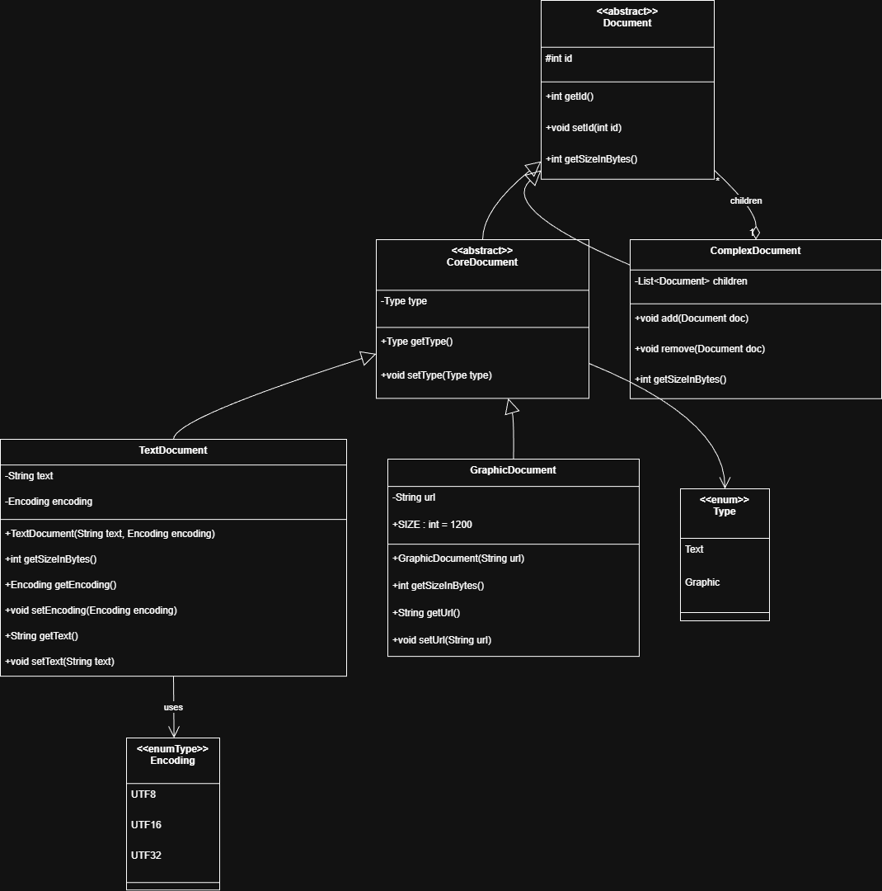
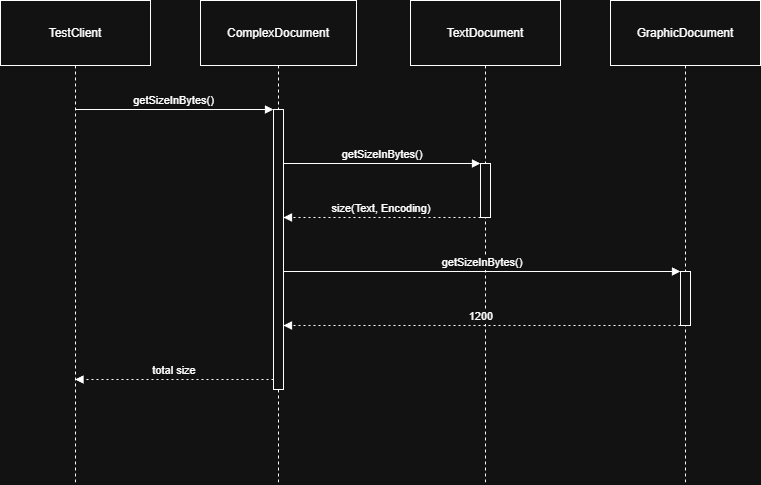

# Übung 9 – Dokumentstruktur (Software Engineering I)

## Diagramme

### UML-Klassendiagramm
Das folgende Diagramm zeigt die vollständige Klassenstruktur inklusive Vererbung, Assoziationen und Enums:

### Sequenzdiagramm
Das Sequenzdiagramm stellt die synchrone Interaktion bei der Erstellung und Auswertung der Byte-Größe für die Substruktur ausgehend von `doc3` dar:

